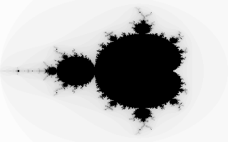

# WASI Mandelbrot programs

These two Go guests render the Mandelbrot set as a binary PGM image. They read
WASI arguments and write the image to WASI stdout. Progress goes to stderr, so
shell redirection produces a valid image.



Run the direct CPU program:

```sh
go run ./examples/mandelbrot > mandelbrot-cpu.pgm
```

Run the buffer program with CPU fallback:

```sh
go run ./examples/mandelbrot -program buffers -cpu > mandelbrot-fallback.pgm
```

Run every buffer pass on a real GPU:

```sh
./native/build.sh
go run -tags webgpu ./examples/mandelbrot -program buffers -require-gpu > mandelbrot-gpu.pgm
```

Open the `.pgm` file in an image viewer. To change the image settings, use
`-width`, `-height`, and `-iterations`. Defaults are 1920×1080 pixels and 64
iterations. Width and height are limited to 4096, the image is limited to
4,194,304 pixels, and iterations are limited to 128. This includes 2560×1440
images and keeps the buffer path within the plugin's 256 MiB instance cap.
These bounds also apply when running the guests under another WASI runtime.

Render a 1440p image with:

```sh
go run -tags webgpu ./examples/mandelbrot -program buffers -require-gpu \
  -width 2560 -height 1440 -iterations 64 > mandelbrot-1440p.pgm
```

## Guest programs

- [cpu.go](guest/cpu.go) computes each pixel directly in Wasm. It has no GPU
  imports. This is the shorter program and the native Wago CPU reference.
- [gpu.go](guest/gpu.go) creates four F32 buffers: real/imaginary coordinates and
  real/imaginary orbit values. Its exported kernel performs one `z = z*z+c`
  iteration across all pixels. The shader is compiled from that Wasm body.
- [common.go](guest/common.go) selects the image settings and writes the PGM.
- [wasi.go](guest/wasi.go) contains the small argument and output helpers. Direct
  WASI imports let TinyGo build without a scheduler that changes the kernel body.

The current shader subset supports arithmetic, buffer access, and local values.
The guest handles iteration, comparisons, first-escape counts, and pixel shades.
After each pass it copies both orbit buffers back for the escape check. Status 1
runs the same formulas on the CPU using current guest arrays and bulk output
sets. The render loop keeps these inputs current after each successful pass.
The exported CPU runner refreshes all inputs for an independent call. Neither
path makes a host call for each pixel. Other statuses stop the program.

This example shows the contract and produces a real Mandelbrot image. Repeated
readbacks and full-output seed copies can make it slower than the direct CPU
program. It makes no speedup claim. GPU float arithmetic follows the plugin's
relaxed contract, so pixels near the set boundary can differ from CPU output.

## WASI and build

The Go host uses `github.com/wago-org/wasi/p1` for Preview 1. It supplies stdout,
stderr, and arguments; it mounts no host directories. The CPU guest can also
run directly in Wasmtime:

```sh
wasmtime examples/mandelbrot/cpu.wasm > mandelbrot-wasmtime.pgm
```

Both checked-in guests are built with TinyGo 0.42.0. To rebuild:

```sh
go generate ./examples/mandelbrot
```

This uses `-target=wasi -scheduler=none -panic=trap -gc=leaking -opt=2`.
The Go host requires no guest compiler at run time. Guest memory lasts for one
bounded command; the buffer guest frees its four handles before it returns.

## Checks

```sh
CGO_ENABLED=0 go test ./examples/mandelbrot
WAGO_GPU_TEST=1 go test -race -tags webgpu ./examples/mandelbrot
```

Tests cover known real-axis points, conjugate symmetry, CPU/buffer agreement,
counts around a 256-element workgroup boundary, actual Wasm translation, argument
limits, and WASI output errors. The hardware test requires every requested pass
to use the GPU and compares the full image with the CPU reference on its test
grids, including full-HD and 1440p one-pass images. Real runs also verify the guest freed its handles.

The earlier 96×64 image was also checked on an NVIDIA RTX 4060 Laptop GPU using
Vulkan. All 32 passes ran on the GPU. The CPU, fallback, GPU, and Wasmtime files
were identical. See the [recorded commands and hashes](../../results/mandelbrot-example-checks.txt).

## Benchmarks

Run the direct CPU and required GPU cases:

```sh
GOMAXPROCS=1 WAGO_GPU_TEST=1 go test -tags webgpu ./examples/mandelbrot \
  -run '^$' -bench '^BenchmarkMandelbrot/(96x64|256x192|512x512)/(cpu|gpu)$' \
  -benchtime=3x -count=3 -benchmem
```

The scalar buffer CPU fallback in the earlier measurements was slow. The current
runner uses bulk transfers. To measure all three paths at full-HD and 1440p:

```sh
GOMAXPROCS=1 WAGO_GPU_TEST=1 go test -tags webgpu ./examples/mandelbrot \
  -run '^$' -bench '^BenchmarkMandelbrot/(1920x1080|2560x1440)/(cpu|fallback|gpu)$' \
  -benchtime=3x -count=3 -benchmem
```

All cases use 32 iterations. `SetupAndRender` includes new runtime, module,
device, and instance setup plus cleanup. `ReuseModule` retains the runtime,
module, device, and pipeline, but creates a new WASI command instance and new
buffers for each image. Both run in one Go process and send output to
`io.Discard`. The image comparison runs before timing. The GPU cases fail if
any pass uses fallback.

See [the measurements and limits](BENCHMARKS.md) for the earlier results.
The [large-image and scratch-buffer report](PERFORMANCE.md) contains the earlier
full-HD and 1440p storage measurements.
The [latest performance report](PERFORMANCE_FOLLOWUP.md) records CPU input reuse,
GPU copy checks, unchanged-parameter reuse, and a separate-output layout that
was tested and removed because of its memory cost.

To measure fresh-process time and maximum RSS on Linux, build the host first.
The Python helper runs the historical 96×64, 32-iteration image three times
in each mode and checks that all nine images match:

```sh
mkdir -p .cache
go build -tags webgpu -o .cache/mandelbrot-bench ./examples/mandelbrot
python3 examples/mandelbrot/bench_processes.py .cache/mandelbrot-bench \
  > .cache/mandelbrot-processes.json
```
